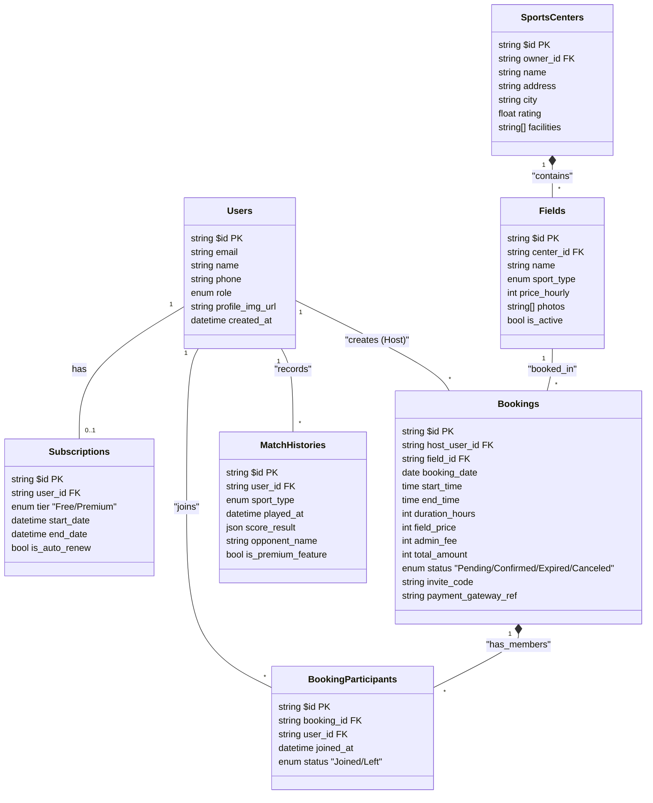

# Entity Relationship Diagram (ERD)
## Aplikasi Gsports (SportHub) v2.0
**Target Platform:** Mobile (Android & iOS) via Flutter  
**Nama Produk:** Gsports
**Versi:** 1.0
**Tanggal:** 27 November 2025
| **Status Dokumen** | Draft                                        |
| ------------------ | -------------------------------------------- |
| **Versi Dokumen**  | 1.0                                          |
| **Penyusun**       | Ahmad Rois (221240001239) M. Gilang M.W. Sabdokafi (221240001248) 
---

## 1. Pendahuluan

### 1.1 Tujuan
Dokumen ini merepresentasikan struktur data logis untuk aplikasi Gsports. ERD ini menjadi cetak biru (*blueprint*) bagi tim *Backend* dalam merancang koleksi Appwrite dan tim *Mobile* dalam merancang database lokal Drift (untuk fitur offline scoreboard).

### 1.2 Lingkup Entitas
Diagram mencakup entitas utama untuk manajemen:
1.  **Pengguna & Keanggotaan** (`Users`, `Subscriptions`)
2.  **Mitra & Lapangan** (`SportsCenters`, `Fields`)
3.  **Transaksi** (`Bookings`, `BookingParticipants`)
4.  **Utilitas Olahraga** (`MatchHistories`)

---

## 2. Daftar Entitas & Atribut Utama

Berikut adalah tabel definisi entitas beserta atribut kuncinya.

| Entitas | Deskripsi | Atribut Utama (Key Attributes) |
| :--- | :--- | :--- |
| **Users** | Menyimpan data akun pengguna (Host/Guest yang sudah register). | `$id` (PK), `email`, `name`, `phone`, `role` (user/admin), `profile_img` |
| **Subscriptions** | Status langganan pengguna. | `$id` (PK), `user_id` (FK), `tier` (free/premium), `start_date`, `end_date`, `status` (active/expired) |
| **SportsCenters** | Profil mitra penyedia tempat olahraga. | `$id` (PK), `owner_id` (FK), `name`, `address`, `city`, `geo_lat`, `geo_long`, `facilities` (array) |
| **Fields** | Aset lapangan spesifik di dalam SC. | `$id` (PK), `center_id` (FK), `name` (Lap. A), `sport_type` (badminton/futsal/etc), `price_per_hour`, `is_active` |
| **Bookings** | Transaksi penyewaan lapangan. | `$id` (PK), `field_id` (FK), `host_user_id` (FK), `book_date`, `start_time`, `end_time`, `total_price`, `admin_fee`, `status` (pending/confirmed/cancelled), `invite_code` |
| **BookingParticipants** | Tabel relasi untuk mencatat teman yang "join" booking. | `$id` (PK), `booking_id` (FK), `user_id` (FK), `joined_at`, `payment_status` (unpaid/paid_to_host - *catatan saja*) |
| **MatchHistories** | Riwayat skor pertandingan (hasil sync dari lokal). | `$id` (PK), `user_id` (FK), `sport_type`, `match_date`, `duration`, `score_detail_json` (skor set/babak), `opponent_name` (opsional) |

---

## 3. Relasi Antar Entitas

### 3.1 Users - Subscriptions
*   **Relasi:** One-to-One (Opsional)
*   **Kardinalitas:** `1..0/1`
*   **Deskripsi:** Satu user *bisa* memiliki satu data subscription aktif. Jika tidak ada data, diasumsikan tier 'Free'.

### 3.2 SportsCenters - Fields
*   **Relasi:** One-to-Many
*   **Kardinalitas:** `1..*`
*   **Deskripsi:** Satu Sports Center memiliki banyak lapangan. Satu lapangan hanya milik satu SC.

### 3.3 Users - Bookings (Host)
*   **Relasi:** One-to-Many
*   **Kardinalitas:** `1..*`
*   **Deskripsi:** Satu user (sebagai Host) bisa membuat banyak booking. Satu booking hanya dibuat oleh satu Host.

### 3.4 Fields - Bookings
*   **Relasi:** One-to-Many
*   **Kardinalitas:** `1..*`
*   **Deskripsi:** Satu lapangan bisa memiliki banyak jadwal booking (pada waktu berbeda). Satu booking merujuk ke satu lapangan spesifik.

### 3.5 Bookings - Users (Participants)
*   **Relasi:** Many-to-Many (via `BookingParticipants`)
*   **Kardinalitas:** `*..*`
*   **Deskripsi:** Satu booking bisa diikuti banyak user (selain Host). Satu user bisa join ke banyak booking berbeda.
*   **Implementasi:** Menggunakan tabel perantara `BookingParticipants`.

### 3.6 Users - MatchHistories
*   **Relasi:** One-to-Many
*   **Kardinalitas:** `1..*`
*   **Deskripsi:** Satu user memiliki banyak riwayat pertandingan.

---

## 4. Diagram Mermaid (ERD Visual)

---

## 5. Catatan Integritas & Desain

### 5.1 Integritas Data (Constraints)
1.  **Unique Invite Code:** Kolom `invite_code` pada tabel `Bookings` harus bersifat UNIK (atau kombinasi unik `booking_id` + `code`) untuk mencegah user salah masuk "kamar" booking orang lain.
2.  **No Double Booking:** Kombinasi `field_id`, `booking_date`, dan `start_time` harus unik di tabel `Bookings` untuk status `Confirmed` atau `Pending`. Sistem *Backend* harus memvalidasi ini sebelum *insert*.
3.  **Cascade Delete:**
    *   Jika `Users` dihapus -> Data `MatchHistories` dan `Subscriptions` ikut dihapus. Data `Bookings` (sebagai Host) sebaiknya di-*soft delete* atau di-anonymize untuk keperluan laporan keuangan SC.
    *   Jika `Bookings` dihapus/batal -> Data `BookingParticipants` ikut dihapus.

### 5.2 Desain JSON Field (Scoreboard)
*   Untuk fleksibilitas fitur Scoreboard yang aturan mainnya variatif (Badminton vs Basket vs Golf), kolom `score_result` pada `MatchHistories` menggunakan tipe **JSON**.
*   *Contoh Badminton:* `{"sets": [{"me": 21, "op": 19}, {"me": 21, "op": 15}], "winner": "me"}`
*   *Contoh Basket:* `{"q1": 10, "q2": 15, "q3": 12, "q4": 20, "fouls": 3}`

### 5.3 Optimasi Query (Indexing)
Untuk menjaga performa aplikasi (terutama pencarian lapangan), indexing wajib diterapkan pada:
*   `Fields`: `sport_type`, `price_hourly`
*   `SportsCenters`: `city`
*   `Bookings`: `booking_date`, `host_user_id`, `invite_code`

---

## 6. Pertanyaan Klarifikasi

1.  **Data Guest di BookingParticipants:** Apakah user yang join booking *wajib* punya akun terdaftar?
    *   *Saran Desain:* Ya, untuk pencatatan yang rapi. Jika tidak, tabel `BookingParticipants` perlu kolom `guest_name` (string) sebagai *fallback* jika `user_id` kosong.
2.  **Histori Pembayaran Langganan:** Apakah kita perlu menyimpan riwayat pembayaran Subscription secara terpisah (misal: tabel `SubscriptionInvoices`)?
    *   *Saran Desain:* Untuk MVP, bisa digabung di tabel `Subscriptions` (simpan tanggal terakhir bayar). Untuk fase scaling, pisahkan untuk keperluan audit.