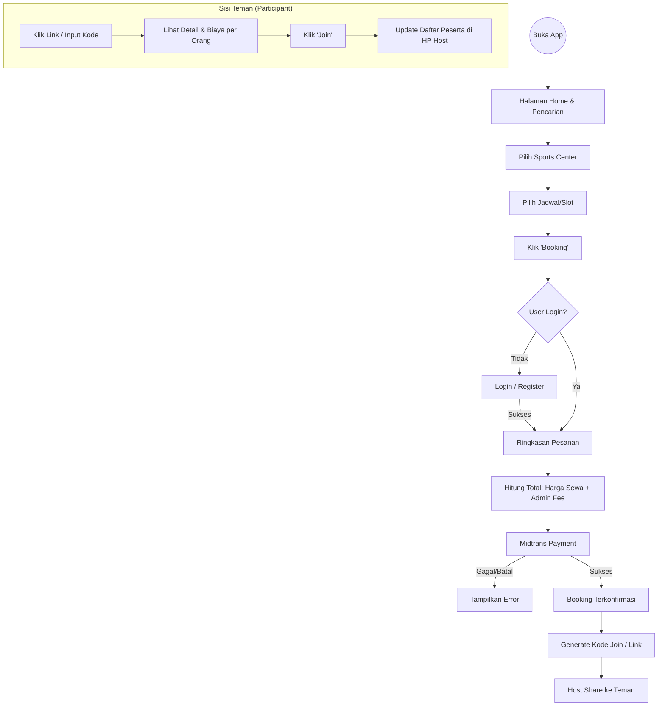
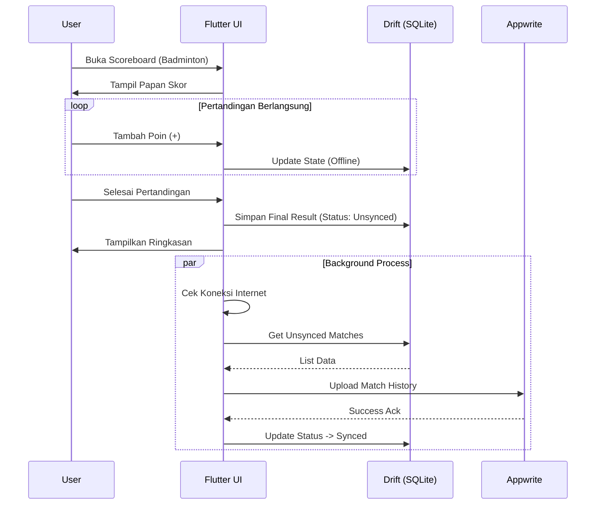

# Product Requirements Document (PRD)
**Target Platform:** Mobile (Android & iOS) via Flutter  
**Nama Produk:** Gsports
**Versi:** 1.0
**Tanggal:** 27 November 2025
| **Status Dokumen** | Draft                                        |
| ------------------ | -------------------------------------------- |
| **Versi Dokumen**  | 1.0                                          |
| **Penyusun**       | Ahmad Rois (221240001239) M. Gilang M.W. Sabdokafi (221240001248) 

---

## 1. Ringkasan Eksekutif
**Gsports** bertransformasi dari sekadar aplikasi pemesanan lapangan menjadi **Super App Olahraga**. Aplikasi ini menggabungkan ekosistem marketplace lapangan olahraga (Booking System) dengan utilitas pencatatan skor (Scoreboard Tool).

Pengembangan fase ini berfokus pada penghapusan friksi pengguna baru (*Lazy Login*), peningkatan retensi pengguna melalui fitur utilitas (Papan Skor & Sync), serta diversifikasi arus pendapatan melalui Biaya Admin per transaksi dan Model Berlangganan (Premium Subscription) untuk fitur analitik/olahraga eksklusif.

---

## 2. Tujuan Produk & Value Proposition

### 2.1 Tujuan Bisnis
1.  **Meningkatkan Akuisisi:** Mengurangi *bounce rate* pengguna baru dengan menunda kewajiban login (*Lazy Login*).
2.  **Diversifikasi Revenue:**
    *   **Transactional:** Mengambil margin keuntungan dari setiap pemesanan (Admin Fee).
    *   **Recurring:** Pendapatan berulang dari langganan Premium untuk fitur Scoreboard lanjutan.
3.  **Meningkatkan Retensi:** Menjadikan aplikasi tetap relevan digunakan saat bermain (via fitur Papan Skor), bukan hanya saat memesan.

### 2.2 Value Proposition
*   **Bagi Pemain Kasual:** "Cari lapangan tanpa ribet daftar akun dulu, dan ajak teman patungan dengan mudah."
*   **Bagi Pemain Kompetitif:** "Catat skor pertandinganmu, simpan riwayat kemenangan, dan analisa performamu."
*   **Bagi Pemilik Lapangan (SC):** "Terima booking pasti bayar (karena Host membayar penuh di awal)."

---

## 3. Persona Pengguna

| Persona | Deskripsi | Motivasi Utama | Pain Point |
| :--- | :--- | :--- | :--- |
| **Budi (The Host)** | Karyawan, 28th. Suka mengorganisir futsal/badminton mingguan. | Mencari lapangan dengan cepat, memastikan teman-teman tahu jadwal. | Ribet menagih uang teman, malas login di awal hanya untuk cek harga. |
| **Dani (The Guest)** | Mahasiswa, 22th. Diajak Budi main. | Ingin tahu lokasi dan jam main. | Tidak mau download aplikasi berat jika hanya untuk melihat jadwal. |
| **Siska (The Pro)** | Eksekutif, 35th. Main Tenis/Golf rutin. | Melacak perkembangan permainan (skor/stats). | Aplikasi skor biasa tidak menyimpan riwayat, booking lapangan tenis susah. |
| **Pak Haji (SC Owner)** | Pemilik GOR Badminton. | Lapangan penuh, pembayaran lancar. | Tidak mau pusing urusan user split bill, maunya terima beres. |

---

## 4. User Journey & Use Cases

### 4.1 UC-01: Guest Booking Experience (Lazy Login)
1.  User membuka aplikasi -> Tampil Home (tanpa Login).
2.  User mencari lapangan Badminton di Jakarta Selatan.
3.  User melihat detail GOR, foto, dan jadwal tersedia.
4.  User memilih slot jam 20.00 - 21.00.
5.  User klik "Booking Sekarang".
6.  **System:** Trigger pop-up/halaman Login atau Register.
7.  User login/daftar -> Lanjut ke pembayaran.

### 4.2 UC-02: Patungan (Split Bill - Host Pay Model)
1.  **Host** menyelesaikan pembayaran booking (Harga Lapangan + Admin Fee).
2.  Booking sukses. Muncul tombol "Undang Teman" atau "Kode Booking".
3.  **Host** membagikan Link/Kode ke grup WhatsApp.
4.  **Teman** klik link (deeplink) -> Masuk aplikasi Gsports.
5.  **Teman** melihat detail booking dan estimasi biaya per orang.
6.  **Teman** klik "Join Booking" -> Nama mereka muncul di daftar peserta booking Host.

### 4.3 UC-03: Scoreboard & Sync (Hybrid)
1.  User berada di lapangan (mungkin sinyal buruk).
2.  Buka menu "Scoreboard" -> Pilih "Badminton".
3.  Set nama pemain -> Mulai pertandingan (Data disimpan di Local DB/Drift).
4.  Pertandingan selesai -> Skor akhir muncul.
5.  Saat sinyal bagus/kembali ke Home -> **System:** Auto-sync data lokal ke Cloud (Appwrite) untuk masuk ke riwayat profil.

---

## 5. Fitur Utama & Spesifikasi

### 5.1 Modul Booking & Transaksi
*   **F-01 Lazy Login:** Akses `Read` ke database lapangan dibuka untuk publik (`role:guest`). Akses `Write` (Booking) dibatasi untuk `role:member`.
*   **F-02 Admin Fee:** Logika backend menambahkan *flat fee* (misal Rp 2.000) atau *percentage* di atas harga lapangan saat *checkout*.
*   **F-03 Host-Pay Payment:** Integrasi Midtrans. Status booking hanya `Confirmed` jika Host membayar 100% tagihan. Tidak ada pembayaran parsial di sistem.
*   **F-04 Participant Management:** Fitur bagi Host untuk melihat siapa saja user yang sudah "Join" via kode unik booking.

### 5.2 Modul Utilitas (Scoreboard)
*   **F-05 Multi-Sport Scoreboard:** UI khusus per olahraga.
    *   *Basic (Free):* Futsal (Timer), Badminton (Set), Basket (Quarter).
    *   *Advanced (Premium Focus):* Tenis (Game/Set/Match rule), Golf (Par/Stroke), Billiard.
*   **F-06 Offline-First Architecture:** Menggunakan Drift untuk menyimpan state pertandingan secara real-time di perangkat. Mencegah data hilang jika aplikasi crash atau internet mati.
*   **F-07 Cloud Sync:** Background worker untuk mengunggah hasil pertandingan `local_matches` ke server `match_history` saat online.

### 5.3 Modul Membership (Premium)
*   **F-08 Subscription Tier:**
    *   **Free:** Booking semua lapangan, Scoreboard Basic (Badminton, Futsal, Basket), ada Iklan (opsional).
    *   **Premium:** Bebas Admin Fee (opsional promo), Scoreboard Eksklusif (Tenis, Golf, Padel) dengan analitik mendalam, Simpan riwayat pertandingan tanpa batas.
*   **F-09 Gatekeeping:** Logika pengecekan status langganan saat user mencoba mengakses fitur Scoreboard tipe Premium.

---

## 6. Diagram Alur Sistem (Mermaid)

### 6.1 Alur Booking dengan Lazy Login & Pembayaran Host

### 6.2 Alur Hybrid Scoreboard (Offline to Online)

---

## 7. Roadmap & Prioritas (MoSCoW)

| Fase | Prioritas | Fitur | Keterangan |
| :--- | :--- | :--- | :--- |
| **MVP (V1)** | **MUST** | Lazy Login & Booking Flow | Core business. |
| | **MUST** | Payment Gateway + Admin Fee | Revenue stream utama. |
| | **MUST** | Basic Scoreboard (Offline) | Futsal, Badminton, Basket. |
| | **SHOULD** | Cloud Sync Riwayat Skor | Agar data user aman. |
| | **SHOULD** | Fitur "Join Booking" (Patungan) | Versi dasar (hanya list nama). |
| **V1.5** | **SHOULD** | Premium Subscription | Implementasi Paywall untuk fitur advanced. |
| | **COULD** | Scoreboard Tenis & Golf | Ruleset lebih kompleks. |
| **V2.0** | **COULD** | Advanced Analytics | Grafik performa user (Menang/Kalah). |
| | **WON'T** | Social Feed / Community | Fokus ke utilitas dulu, bukan sosmed. |

---

## 8. Struktur Database (Schema Overview)

Berikut adalah penyesuaian skema database untuk mendukung fitur baru.

**Appwrite (Cloud):**
*   `bookings`: Tambah kolom `admin_fee`, `total_bill`, `invite_code`, `host_user_id`.
*   `booking_participants`: `booking_id`, `user_id`, `joined_at`.
*   `subscriptions`: `user_id`, `tier_type` (free/premium), `start_date`, `end_date`.
*   `match_histories`: `user_id`, `sport_type`, `score_result` (JSON), `played_at`.

**Drift (Local):**
*   `local_matches`: `id`, `sport_type`, `current_score_json`, `is_finished`, `sync_status` (0=pending, 1=synced).

---

## 9. Risiko & Mitigasi

| Risiko | Dampak | Mitigasi |
| :--- | :--- | :--- |
| **User Batal Bayar ke Host** | Host merasa dirugikan dan menyalahkan aplikasi. | Tampilkan disclaimer jelas: *"Aplikasi hanya mencatat partisipan. Penagihan uang adalah tanggung jawab Host."* |
| **Data Skor Hilang** | User kecewa, kehilangan trust. | Implementasi *local persistence* yang agresif (simpan tiap perubahan poin). |
| **Payment Gateway Down** | Tidak bisa booking. | Sediakan opsi transfer manual (verifikasi admin) sebagai fallback darurat (fitur Admin Panel). |
| **Churn Rate Tinggi** | User instal, booking sekali, lalu uninstall. | Gunakan notifikasi pengingat jadwal main dan *gamification* di fitur Scoreboard (Badges/Achievements). |

---

## 10. Metrik Kesuksesan (KPI)

1.  **Guest Conversion Rate:** % user tamu yang akhirnya melakukan Login/Register.
2.  **Booking Completion Rate:** % user yang menyelesaikan pembayaran setelah klik "Booking".
3.  **Utility Retention:** Jumlah rata-rata pertandingan yang dicatat via Scoreboard per user aktif per bulan.
4.  **Admin Fee Revenue:** Total pendapatan bersih dari biaya admin.
5.  **Premium Conversion:** % user gratis yang upgrade ke Premium.

---

## 11. Pertanyaan Klarifikasi (Untuk Tim Pengembang)

1.  **Detail Aturan Tenis/Golf:** Apakah kita perlu aturan standar turnamen (ITF) atau aturan kasual untuk MVP papan skor Tenis? *Saran: Mulai dengan aturan kasual yang disederhanakan.*
2.  **Nominal Admin Fee:** Apakah flat (Rp X) atau persentase (%)? *Saran: Flat fee lebih mudah diterima user untuk transaksi kecil-menengah.*
3.  **Mekanisme Refund:** Jika Host membatalkan booking, apakah Admin Fee dikembalikan? *Saran: Admin Fee hangus (tidak dikembalikan) untuk menutup biaya gateway.*