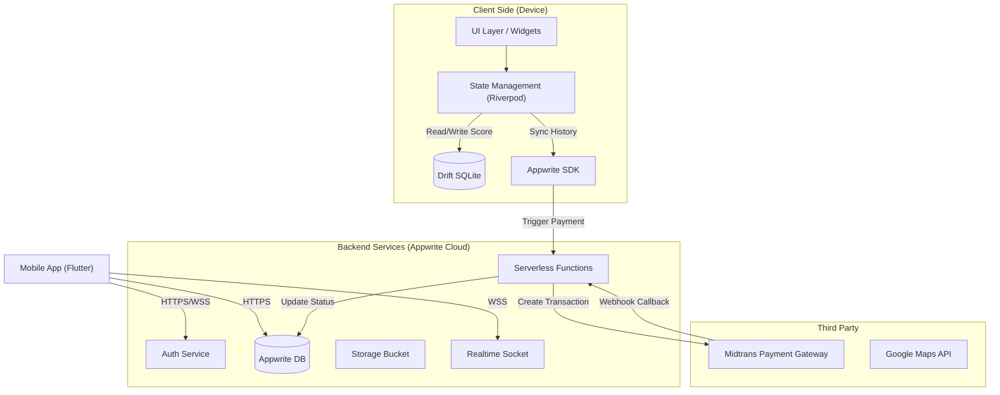
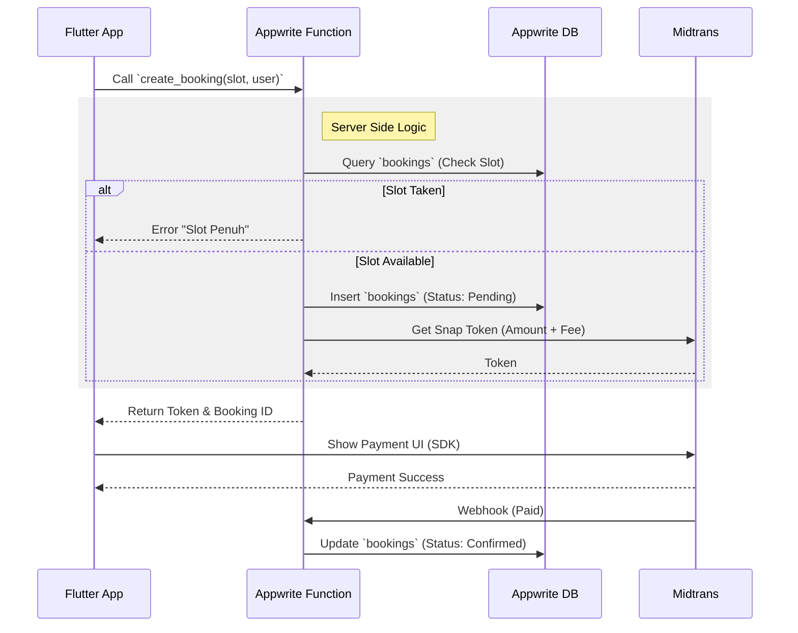
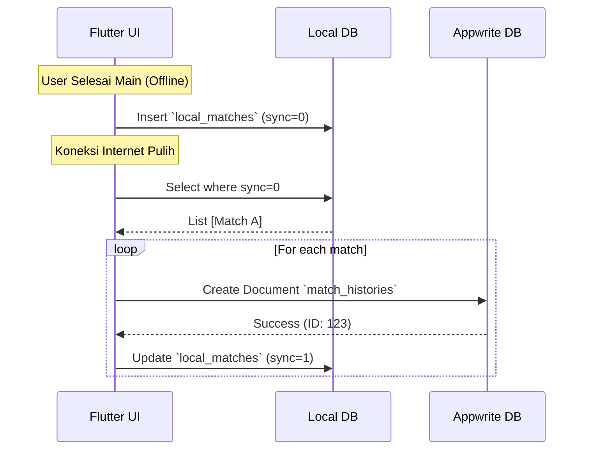

# Software Design Document (SDD)
## Aplikasi Gsports (SportHub) v2.0
**Target Platform:** Mobile (Android & iOS) via Flutter  
**Nama Produk:** Gsports
**Versi:** 1.0
**Tanggal:** 27 November 2025
| **Status Dokumen** | Draft                                        |
| ------------------ | -------------------------------------------- |
| **Versi Dokumen**  | 1.0                                          |
| **Penyusun**       | Ahmad Rois (221240001239) M. Gilang M.W. Sabdokafi (221240001248) 
---

## 1. Pendahuluan

### 1.1 Tujuan
Dokumen ini mendefinisikan arsitektur sistem, desain komponen, dan antarmuka teknis untuk Gsports v2.0. Dokumen ini bertujuan untuk memandu tim *Engineering* dalam membangun sistem yang *scalable*, aman, dan *maintainable*, khususnya dalam mengelola dualitas fungsi *Online Booking* dan *Offline-First Scoreboard*.

### 1.2 Lingkup Desain
Desain ini mencakup:
*   Arsitektur *Client-Server* hibrida (Cloud + Local DB).
*   Integrasi layanan pihak ketiga (Midtrans Payment, Maps).
*   Mekanisme sinkronisasi data (*Local-to-Cloud Sync*).
*   Desain API dan struktur modular kode.

---

## 2. Arsitektur Sistem

### 2.1 Deskripsi High-Level
Gsports menggunakan arsitektur **Hybrid Client-Server**.
*   **Booking System:** Menggunakan pola *Thin Client*. Logika validasi slot dan pembayaran terjadi di Server (Appwrite Functions) untuk keamanan.
*   **Scoreboard System:** Menggunakan pola *Thick Client* (Offline-First). Logika permainan dan penyimpanan data sementara terjadi di perangkat pengguna (Drift), disinkronkan ke Cloud saat online.

### 2.2 Diagram Arsitektur (Mermaid)

---

## 3. Desain Modul (Modularization)

Kode akan diatur menggunakan struktur *Feature-First* dalam Clean Architecture.

### 3.1 Modul Core
*   **Tanggung Jawab:** Menyediakan utilitas dasar (Networking, Theme, Shared Widgets).
*   **Komponen:** `ApiClient`, `LocalStorageService`, `AppRouter`.

### 3.2 Modul Auth & User
*   **Fitur:** Login/Register, Guest Session, Profile Management.
*   **Mekanisme:** Menggunakan Appwrite Auth.
    *   *Lazy Login:* `Account.get()` dipanggil hanya saat diperlukan. Jika gagal (401), arahkan ke UI Login.

### 3.3 Modul Booking (Cloud-First)
*   **Fitur:** Search SC, Slot Selection, Create Booking.
*   **Logika Kritis:**
    *   *Concurrency:* Appwrite Function `createBooking` menggunakan *atomic check* untuk memastikan slot kosong sebelum insert.

### 3.4 Modul Payment & Fee
*   **Fitur:** Menghitung total tagihan, integrasi Midtrans.
*   **Logika:**
    *   `Total = Field Price + Admin Fee`.
    *   Snap Token di-generate oleh backend, dikirim ke client untuk menampilkan UI pembayaran.

### 3.5 Modul Scoreboard (Local-First)
*   **Fitur:** Papan skor interaktif, Ruleset logika (Badminton/Basket).
*   **Mekanisme:**
    *   Data disimpan di tabel `local_matches` (Drift).
    *   *Sync Worker:* Background service mengecek `connectivity` dan `local_matches.sync_status == 0`. Jika online, upload ke Appwrite.

### 3.6 Modul Subscription
*   **Fitur:** Upgrade plan, cek hak akses fitur.
*   **Logika:**
    *   User attribute `subscription_tier` dicek sebelum membuka halaman Scoreboard Premium (Tenis/Golf).

---

## 4. API Utama & Endpoint (Appwrite Functions / Database SDK)

Karena menggunakan BaaS (Appwrite), "Endpoint" di sini merujuk pada *Functions* atau operasi Database langsung.

| Nama Fungsi/Operasi | Input | Output | Deskripsi |
| :--- | :--- | :--- | :--- |
| `func_create_booking` | `field_id`, `date`, `time`, `host_id` | `booking_id`, `payment_token`, `total_amount` | Membuat booking, cek slot, hitung fee, request Midtrans token. |
| `func_join_booking` | `invite_code`, `user_id` | `status`, `booking_detail` | Memvalidasi kode undangan dan menambahkan user ke peserta. |
| `func_handle_payment` | `order_id`, `transaction_status` | `ack` | Webhook handler untuk menerima status bayar dari Midtrans. |
| `db_list_fields` | `filter: city`, `filter: sport` | `List<Field>` | Mengambil daftar lapangan (Public Read). |
| `db_sync_match` | `match_json` | `match_id` | Mengunggah hasil skor lokal ke cloud. |

---

## 5. Alur Data (Diagram Sekuens)

### 5.1 Sequence: Booking & Payment Flow

### 5.2 Sequence: Scoreboard Sync Flow

---

## 6. Keamanan (Security Design)

### 6.1 Authentication & Authorization
*   **RLS (Row Level Security):**
    *   `Bookings`: `read("any")` (untuk cek jadwal), `write("user")`.
    *   `BookingParticipants`: `read("team:booking_participants")` (hanya peserta yg bisa lihat detail teman).
*   **Function Execution:** Hanya boleh dipanggil oleh user terautentikasi (`role:member`) untuk fungsi booking.

### 6.2 Data Protection
*   **Payment Data:** Tokenisasi. Server tidak pernah menyimpan nomor kartu kredit mentah.
*   **Scoreboard Data:** Validasi JSON Schema di backend saat *sync* untuk mencegah injeksi data skor palsu/rusak.

---

## 7. Risiko Teknis & Mitigasi

| Risiko | Mitigasi |
| :--- | :--- |
| **Double Booking (Race Condition)** | Gunakan Appwrite Functions untuk logika booking terpusat. Jangan biarkan Client langsung `create document` di collection Booking. |
| **Data Skor Hilang (App Crash)** | Tulis ke Drift DB setiap perubahan poin (bukan hanya di akhir match). Operasi SQLite sangat cepat (<5ms), jadi aman untuk UX. |
| **Biaya Cloud Membengkak** | Optimalkan query `list documents`. Gunakan *Pagination* dan *Indexing* yang agresif. Jangan tarik data gambar (BLOB) langsung dari DB, gunakan URL Storage CDN. |
| **Midtrans Downtime** | Sediakan *Grace Period* (misal perpanjang waktu bayar 10 menit) jika server payment gateway tidak merespons. |

---

## 8. Observability

*   **Logging:** Semua Appwrite Functions wajib mencetak log `[INFO]`, `[ERROR]`, dan `[WARN]` (misal: "Payment Webhook Received", "Slot Conflict Detected").
*   **Crash Reporting:** Integrasi *Sentry* atau *Firebase Crashlytics* di aplikasi Flutter untuk memantau crash di sisi user (terutama modul Scoreboard).