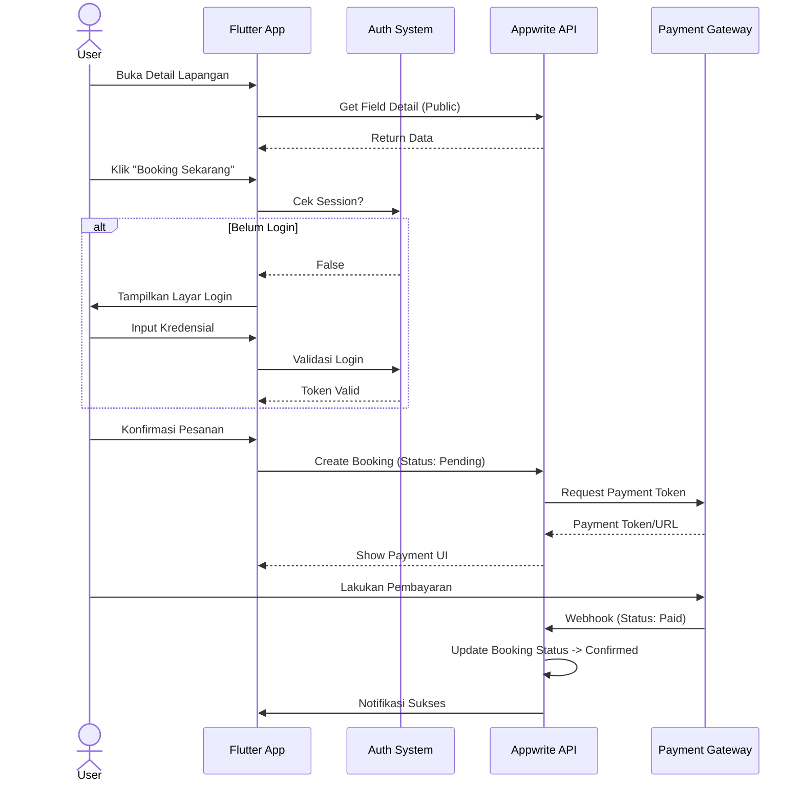
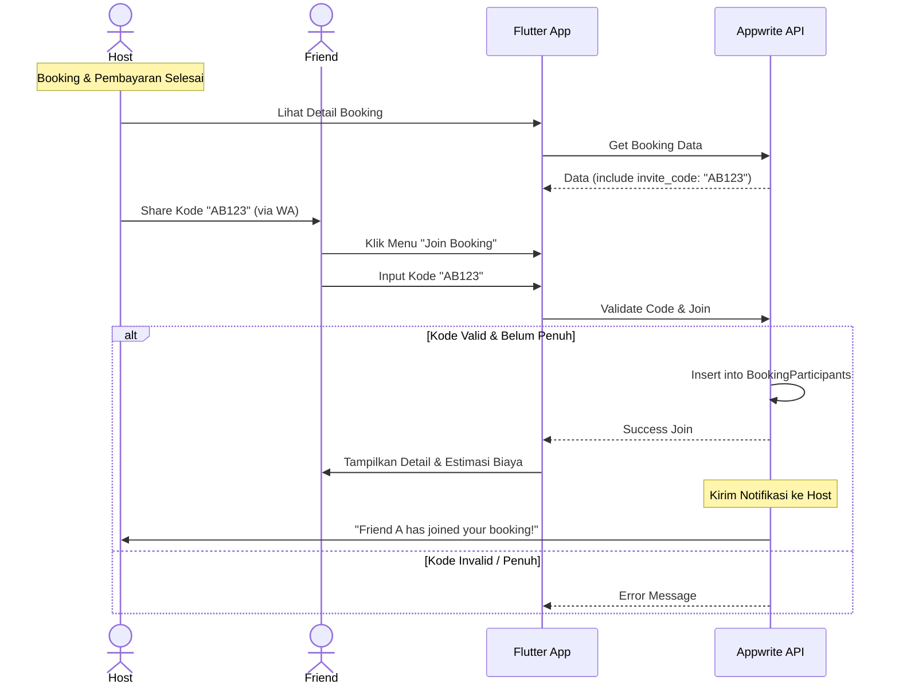

# Software Requirements Specification (SRS)
## Aplikasi Gsports (SportHub) v2.0
**Target Platform:** Mobile (Android & iOS) via Flutter  
**Nama Produk:** Gsports
**Versi:** 1.0
**Tanggal:** 27 November 2025
| **Status Dokumen** | Draft                                        |
| ------------------ | -------------------------------------------- |
| **Versi Dokumen**  | 1.0                                          |
| **Penyusun**       | Ahmad Rois (221240001239) M. Gilang M.W. Sabdokafi (221240001248) 
---

## 1. Pendahuluan

### 1.1 Tujuan
Dokumen ini mendefinisikan spesifikasi kebutuhan perangkat lunak (Software Requirements) untuk pengembangan aplikasi **Gsports** versi 2.0. Dokumen ini menjadi panduan utama bagi tim pengembang (*backend*, *frontend*, *QA*) dalam mengimplementasikan fitur-fitur baru seperti *Lazy Login*, *Scoreboard Utility*, *Membership*, dan mekanisme *Booking* yang ditingkatkan.

### 1.2 Lingkup Sistem
Gsports adalah platform ekosistem olahraga yang mencakup dua domain utama:
1.  **Marketplace Booking:** Memungkinkan pengguna mencari, melihat ketersediaan, dan memesan lapangan olahraga secara *real-time* dengan integrasi pembayaran digital.
2.  **Utility Tools:** Menyediakan fitur papan skor (*scoreboard*) digital yang dapat digunakan secara *offline* dan disinkronkan ke *cloud* untuk pencatatan riwayat aktivitas.

Sistem akan dikembangkan berbasis **Mobile App (Flutter)** dengan backend **Appwrite** (Cloud) untuk manajemen data booking dan user, serta database lokal **Drift** untuk fungsionalitas papan skor *offline*.

### 1.3 Definisi, Akronim, dan Singkatan
*   **SC (Sports Center):** Mitra penyedia lapangan olahraga.
*   **Host:** Pengguna yang melakukan pemesanan dan pembayaran awal.
*   **Guest User:** Pengguna yang belum login/mendaftar.
*   **Drift:** Library database lokal untuk Flutter (SQLite abstraction).
*   **Appwrite:** Platform *Backend-as-a-Service* (BaaS).
*   **Admin Fee:** Biaya layanan aplikasi yang dibebankan per transaksi.
*   **Lazy Login:** Mekanisme menunda kewajiban login hingga aksi krusial (booking/simpan data).

---

## 2. Deskripsi Umum

### 2.1 Perspektif Produk
Gsports beroperasi sebagai *standalone mobile application* yang berkomunikasi dengan layanan backend melalui REST/Socket API. Aplikasi ini mengintegrasikan layanan pihak ketiga:
*   **Midtrans:** Untuk pemrosesan pembayaran (Virtual Account, QRIS, E-Wallet).
*   **Google Maps API:** Untuk lokasi Sports Center.

### 2.2 Fungsi Sistem Utama
1.  **Pencarian & Detail (Public Access):** Melihat daftar SC, fasilitas, dan jadwal tanpa login.
2.  **Manajemen Booking:** Memilih slot, menghitung biaya (Sewa + Admin Fee), dan memproses pembayaran.
3.  **Social Booking (Split Bill):** Host mengundang teman untuk bergabung ke dalam sesi booking via kode/link.
4.  **Digital Scoreboard:** Papan skor interaktif untuk berbagai cabang olahraga (offline-first).
5.  **Membership:** Sistem langganan untuk akses fitur premium (analitik, bebas admin fee, jenis olahraga eksklusif).

### 2.3 Karakteristik Pengguna
*   **Guest:** Pengguna baru/belum login, hanya bisa *view-only*.
*   **Member (Free):** Pengguna terdaftar, bisa booking, pakai scoreboard dasar.
*   **Member (Premium):** Pengguna berbayar, akses fitur scoreboard lanjut & analitik.
*   **SC Admin:** Pengelola lapangan (menggunakan aplikasi/dashboard terpisah/modul khusus).

### 2.4 Batasan Sistem
*   Aplikasi membutuhkan koneksi internet untuk proses Booking dan Sync Riwayat.
*   Fitur Scoreboard harus tetap berfungsi penuh tanpa koneksi internet (*offline*).
*   Pembayaran booking harus diselesaikan dalam batas waktu tertentu (misal: 15 menit) sebelum slot dilepas kembali.

---

## 3. Kebutuhan Fungsional

### 3.1 Modul Autentikasi & Akun
*   **AUTH-01 (Lazy Login):** Sistem mengizinkan akses halaman Home, Search, dan Detail Lapangan tanpa token autentikasi.
*   **AUTH-02 (Trigger Login):** Sistem wajib menampilkan *Login Prompt* saat Guest User menekan tombol "Booking" atau "Simpan Riwayat Skor".
*   **AUTH-03 (Profile):** Pengguna dapat mengelola profil, melihat status langganan, dan riwayat transaksi.

### 3.2 Modul Booking
*   **BOOK-01 (Real-time Availability):** Sistem menampilkan slot waktu berdasarkan data *real-time* dari database.
*   **BOOK-02 (Pricing Engine):** Sistem menghitung `Total Bayar = Harga Slot + Admin Fee`.
*   **BOOK-03 (Payment Processing):** Integrasi dengan Payment Gateway untuk membuat transaksi *pending*.
*   **BOOK-04 (Auto-Cancel):** Sistem otomatis membatalkan booking jika pembayaran tidak diterima dalam kurun waktu `X` menit (Cron Job / Appwrite Function).

### 3.3 Modul Social (Patungan)
*   **SOC-01 (Invite Code):** Setelah pembayaran sukses, sistem meng-generate kode unik/link untuk booking tersebut.
*   **SOC-02 (Join Booking):** Pengguna lain dapat memasukkan kode untuk bergabung ke daftar peserta booking.
*   **SOC-03 (Bill Info):** Sistem menampilkan estimasi biaya per orang (`Total Bayar / Jumlah Peserta Saat Ini`), namun tidak memproses penagihan antar user.

### 3.4 Modul Scoreboard (Utility)
*   **SCORE-01 (Local Match):** Sistem dapat membuat sesi pertandingan baru dan menyimpan perubahan skor ke database lokal (Drift) secara *real-time*.
*   **SCORE-02 (Rule Engine):**
    *   *Badminton:* Poin set, *deuce* (jus), pindah servis.
    *   *Basket:* Quarter timer, shot clock (opsional), foul counter.
*   **SCORE-03 (Cloud Sync):** Sistem mendeteksi koneksi internet dan secara otomatis mengunggah data pertandingan yang belum tersinkronisasi (`sync_status=0`) ke server.

### 3.5 Modul Membership
*   **MEM-01 (Tier Check):** Sistem membatasi akses fitur Scoreboard tertentu (misal: Tenis, Golf) hanya untuk user dengan atribut `subscription_tier = premium`.
*   **MEM-02 (Benefit):** User Premium dibebaskan dari komponen `Admin Fee` saat *checkout* booking (Opsional/Promo).

---

## 4. Kebutuhan Non-Fungsional

### 4.1 Performa
*   **NFR-01 (Response Time):** API Booking harus merespons < 2 detik.
*   **NFR-02 (Scoreboard Latency):** Input skor (tambah poin) harus di-render di UI dalam < 16ms (60 FPS) tanpa *delay* jaringan.
*   **NFR-03 (Concurrency):** Sistem Booking harus menangani *Race Condition* (dua orang booking slot yang sama di detik yang sama) dengan mekanisme *Atomic Lock* atau *Database Transaction*.

### 4.2 Keamanan
*   **NFR-04 (Data Privacy):** Data pribadi pengguna (email, no HP) harus dienkripsi saat istirahat (*at rest*) dan transit (*in transit* TLS 1.2+).
*   **NFR-05 (Payment Security):** Aplikasi tidak menyimpan data kartu kredit/CVV pengguna, sepenuhnya ditangani oleh SDK Payment Gateway.

### 4.3 Keandalan (Reliability)
*   **NFR-06 (Offline Capability):** Modul Scoreboard wajib berfungsi 100% saat mode pesawat (*airplane mode*).

---

## 5. Model Data & Relasi (Skema Logis)

### 5.1 Entitas Utama
1.  **Users:** Data akun pengguna (Guest tidak masuk sini sampai register).
2.  **SportCenters:** Data profil lapangan (Mitra).
3.  **Fields:** Aset lapangan yang bisa disewa.
4.  **Bookings:** Transaksi penyewaan.
5.  **BookingParticipants:** Tabel *junction* untuk fitur "Patungan".
6.  **MatchHistories:** Data hasil pertandingan (skor).

### 5.2 Relasi (ERD Concept)
*   `SportCenters` **1 : N** `Fields`
*   `Fields` **1 : N** `Bookings`
*   `Users` **1 : N** `Bookings` (sebagai Host)
*   `Bookings` **1 : N** `BookingParticipants`
*   `Users` **1 : N** `BookingParticipants` (sebagai Peserta)
*   `Users` **1 : N** `MatchHistories`

---

## 6. Diagram Alur & Interaksi (Mermaid)

### 6.1 Sequence Diagram: Alur Booking (Lazy Login)

Diagram ini menggambarkan alur User Guest yang ingin booking, dipaksa login, lalu lanjut bayar.

### 6.2 Sequence Diagram: Mekanisme Patungan (Join)

Diagram ini menjelaskan bagaimana Host membayar dan Teman bergabung.

---

## 7. Edge Cases & Error Handling

### 7.1 Booking Race Condition
*   **Kasus:** User A dan User B menekan tombol bayar untuk slot yang sama di detik yang sama.
*   **Handling:** Backend (Appwrite Function/Database Transaction) harus mengecek ketersediaan slot *tepat sebelum* membuat invoice pembayaran. Jika slot terambil milidetik sebelumnya, User B mendapat pesan: *"Maaf, slot baru saja diambil orang lain."*

### 7.2 Pembayaran Expired
*   **Kasus:** Host tidak membayar dalam 15 menit.
*   **Handling:** Sistem (Cron Job) mengubah status `Pending` menjadi `Expired`. Slot lapangan dibuka kembali untuk umum secara otomatis.

### 7.3 Sync Conflict (Scoreboard)
*   **Kasus:** User login di 2 HP. Mengupdate skor di HP A (offline), lalu online. Mengupdate di HP B (online).
*   **Handling:** *Last Write Wins* untuk MVP. Data dengan timestamp terbaru yang akan disimpan di server.

### 7.4 Join Booking Setelah Event
*   **Kasus:** Teman mencoba join kode booking untuk pertandingan yang sudah lewat tanggalnya.
*   **Handling:** Sistem menolak join request dengan pesan: *"Pertandingan sudah selesai."*

---

## 8. Pertanyaan Klarifikasi (Outstanding Questions)

Untuk memastikan implementasi sesuai ekspektasi, poin-poin berikut perlu dikonfirmasi oleh Product Owner:

1.  **Kebijakan Refund:** Jika Host membatalkan booking yang sudah ada pesertanya (teman yang join), apakah notifikasi pembatalan dikirim ke semua teman?
    *   *Saran Teknis:* Ya, kirim Push Notification ke semua `user_id` di tabel `BookingParticipants`.
2.  **Limit Peserta:** Apakah ada batas maksimal orang yang bisa join satu booking? (Misal: Lapangan Badminton max 6 orang join).
    *   *Saran Teknis:* Set limit default per jenis olahraga (Badminton=6, Futsal=12) di database.
3.  **Data Guest Scoreboard:** Jika Guest user menggunakan scoreboard (tanpa login), apakah datanya hilang saat aplikasi ditutup?
    *   *Saran Teknis:* Simpan di local storage sementara. Saat user akhirnya login, tawarkan opsi "Import riwayat sesi tamu ke akun saya".