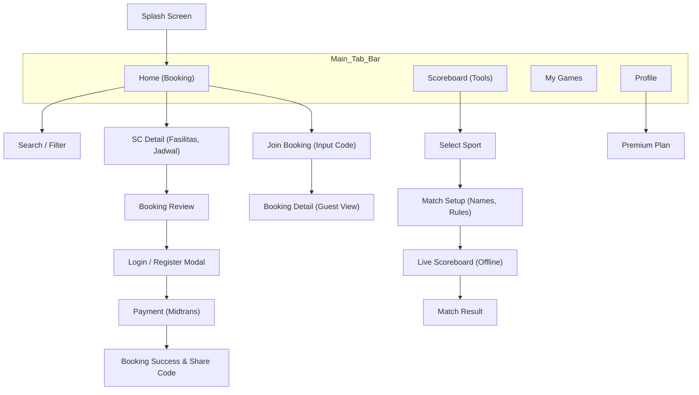
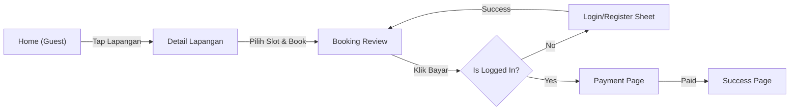
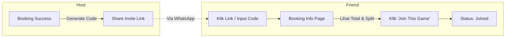
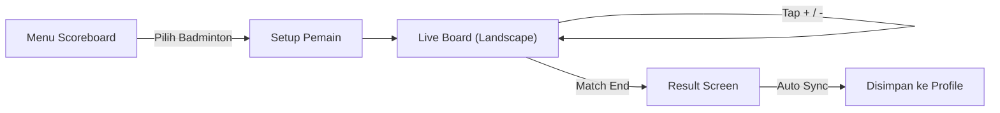

# UI/UX Design Document (UIUX)
## Aplikasi Gsports (SportHub) v2.0
**Target Platform:** Mobile (Android & iOS) via Flutter  
**Nama Produk:** Gsports
**Versi:** 1.0
**Tanggal:** 27 November 2025
| **Status Dokumen** | Draft                                        |
| ------------------ | -------------------------------------------- |
| **Versi Dokumen**  | 1.0                                          |
| **Penyusun**       | Ahmad Rois (221240001239) M. Gilang M.W. Sabdokafi (221240001248) 
---

## 1. Pendahuluan

### 1.1 Tujuan Desain
Tujuan utama desain antarmuka Gsports v2.0 adalah menggabungkan dua fungsi utama yang berbeda karakter: **Marketplace Booking** (yang membutuhkan koneksi dan kepercayaan transaksi) dan **Scoreboard Utility** (yang membutuhkan kecepatan interaksi dan ketersediaan offline).

### 1.2 Prinsip Desain
1.  **Frictionless Onboarding (Lazy Login):** Pengguna tidak boleh dihalangi oleh tembok login saat pertama kali membuka aplikasi. Eksplorasi didahulukan.
2.  **Clarity & Trust:** Harga, biaya admin, dan total tagihan harus transparan sebelum pembayaran. Status "Patungan" harus jelas (siapa Host, berapa estimasi per orang).
3.  **Utility-First:** Fitur Scoreboard harus dapat diakses dengan maksimal 2 kali tap dari halaman utama, dengan tombol interaksi berukuran besar (Fitts's Law) untuk kemudahan penggunaan di lapangan.
4.  **Visual Hierarchy:** Pembedaan visual yang jelas antara status `Pending`, `Confirmed`, dan `Live Match`.

---

## 2. Informasi Arsitektur

### 2.1 Struktur Navigasi (Bottom Bar)
Aplikasi menggunakan navigasi bar bawah dengan 4 menu utama:
1.  **Home (Booking):** Pencarian lapangan, rekomendasi, banner promo.
2.  **Scoreboard (Tools):** Pilihan olahraga untuk papan skor.
3.  **My Games (Activity):** Riwayat booking dan riwayat skor pertandingan.
4.  **Profile:** Akun, langganan premium, pengaturan.

### 2.2 Sitemap & Navigasi Aplikasi (Mermaid)

---

## 3. Wireflow & User Flow

### 3.1 Flow: Guest Booking (Lazy Login)
Alur ini menggambarkan bagaimana pengguna tamu dikonversi menjadi pengguna terdaftar melalui konteks pemesanan.

### 3.2 Flow: Social Booking (Patungan)
Alur Host membayar dan Teman bergabung.

### 3.3 Flow: Scoreboard (Hybrid Offline-Online)
Alur penggunaan papan skor dengan sinkronisasi.

---

## 4. Komponen UI

Berikut adalah spesifikasi komponen UI yang digunakan berulang (Reusable Components).

| Komponen | Deskripsi & Interaksi | State Visual |
| :--- | :--- | :--- |
| **SC Card** | Kartu vertikal menampilkan foto, nama, lokasi, dan harga mulai. | *Default:* Shadow halus. *Pressed:* Scale down 98%. |
| **Slot Picker** | Grid jam (misal: 10:00, 11:00). | *Available:* Outline Hijau. *Selected:* Fill Hijau. *Booked:* Greyed out. |
| **Score Button** | Tombol besar (+) dan kecil (-) untuk input skor. | *Normal:* Warna kontras (Merah/Biru). *Pressed:* Ripple effect. |
| **Join Widget** | Bar info di halaman detail booking untuk Social Booking. | Menampilkan avatar peserta yang sudah join + Estimasi harga per orang. |
| **Premium Banner** | Banner gradasi emas/gelap untuk upsell langganan. | Menampilkan benefit "Unlock Tennis Stats" dll. |
| **Login Modal** | Bottom sheet yang muncul setengah layar (bukan full page). | Input Email/Phone, Button "Masuk", Link "Daftar". |

---

## 5. Style Guide

### 5.1 Palet Warna
Menggunakan skema warna yang energik namun profesional.

| Nama Warna | Kode Hex | Penggunaan |
| :--- | :--- | :--- |
| **Primary Brand** | `#0057FF` | Tombol utama, Header aktif, Ikon aktif. (Electric Blue) |
| **Secondary Accent**| `#FF6B00` | Call to Action (Booking), Notifikasi penting. (Energetic Orange) |
| **Success** | `#00C853` | Slot tersedia, Pembayaran sukses, Skor menang. |
| **Surface** | `#FFFFFF` | Background kartu, Modal. |
| **Background** | `#F4F6F8` | Background aplikasi (Light Grey). |
| **Text Primary** | `#1A1A1A` | Judul, Harga. |

### 5.2 Tipografi
Font Family: **Poppins** (Headings) & **Inter** (Body/UI).

| Style | Size | Weight | Penggunaan |
| :--- | :--- | :--- | :--- |
| **H1** | 24sp | Bold | Nama Lapangan, Judul Halaman Besar. |
| **H2** | 20sp | SemiBold | Sub-judul seksi, Skor Utama. |
| **Body 1** | 16sp | Regular | Teks deskripsi, input form. |
| **Body 2** | 14sp | Medium | Label tombol, info meta. |
| **Score Num**| 64sp+ | Bold | Angka skor di papan skor (Monospace angka). |

### 5.3 Iconography
Menggunakan set ikon **Phosphor Icons** atau **Material Symbols Rounded**.
*   **Navigasi:** Home, Whistle (Score), Ticket (Activity), User.
*   **Aksi:** Plus, Minus, Share, Filter, Calendar.
*   **Status:** Check-circle (Success), Clock (Pending), X-circle (Failed).

---

## 6. Edge Cases UX

### 6.1 Slot Penuh Saat Checkout (Race Condition)
*   **Skenario:** User A melihat slot kosong, klik booking, login. Saat login, User B sudah membayar slot tersebut.
*   **UX Handling:**
    *   Tampilkan *Toast/Snack Bar* Merah: "Yah, slot ini baru saja diambil orang lain."
    *   *Action:* Refresh halaman jadwal otomatis dan minta user memilih jam lain. Jangan lempar ke halaman Home.

### 6.2 Koneksi Putus Saat Scoreboard Sync
*   **Skenario:** Pertandingan selesai, tapi sinyal hilang.
*   **UX Handling:**
    *   Tampilkan ikon "Cloud Off" atau "Pending Sync" di kartu riwayat pertandingan.
    *   *Background:* Aplikasi mencoba sync otomatis saat koneksi kembali.
    *   *Manual:* User bisa pull-to-refresh di halaman Activity untuk memaksa sync.

### 6.3 Anggota Patungan Tidak Bayar
*   **Skenario:** Host sudah share kode, teman join, tapi Host batal main/refund atau teman tidak bayar ke Host.
*   **UX Handling:**
    *   Aplikasi menampilkan *Disclaimer Box* di halaman Join: "Pembayaran patungan dilakukan di luar aplikasi (langsung ke Host). Gsports hanya mencatat daftar nama."
    *   Ini untuk memitigasi ekspektasi user bahwa aplikasi yang menagih uangnya.

### 6.4 Subscription Expired
*   **Skenario:** User Premium mencoba akses Scoreboard Tenis (Advanced) tapi masa aktif habis.
*   **UX Handling:**
    *   Jangan blokir total. Izinkan akses, tapi tampilkan *Bottom Sheet Premium Locked*: "Masa aktif habis. Perpanjang untuk lanjut menggunakan fitur pro ini."
    *   Tombol "Perpanjang" langsung mengarah ke pembayaran.