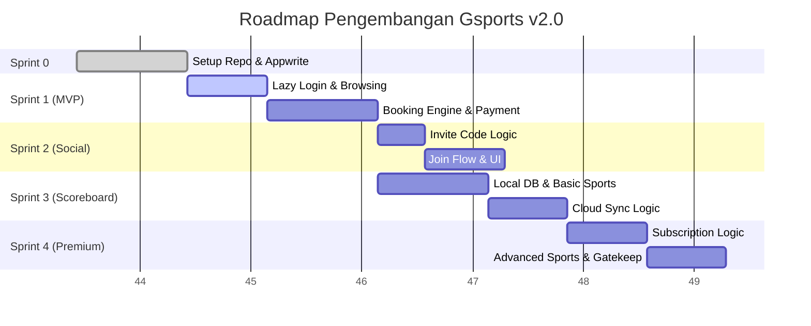
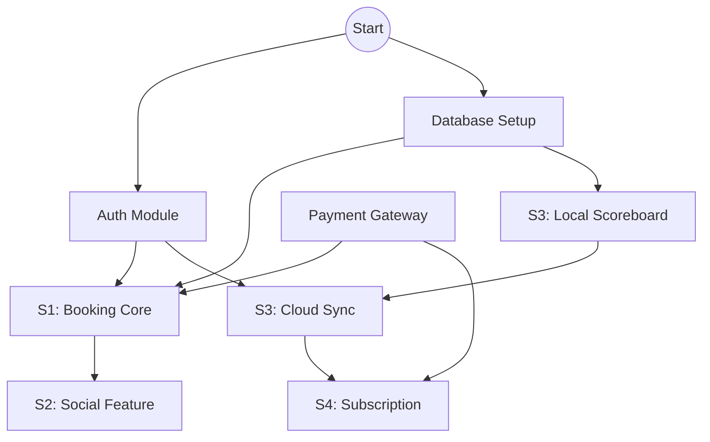

# Sprint Iteration Document (Sprint.md)
## Aplikasi Gsports (SportHub) v1.0
**Target Platform:** Mobile (Android & iOS) via Flutter  
**Nama Produk:** Gsports
**Versi:** 1.0
**Tanggal:** 27 November 2025
| **Status Dokumen** | Draft                                        |
| ------------------ | -------------------------------------------- |
| **Versi Dokumen**  | 1.0                                          |
| **Metodologi**  | Scrum / Agile                                          |
| **Penyusun**       | Ahmad Rois (221240001239) M. Gilang M.W. Sabdokafi (221240001248) 
---

## 1. Pendahuluan

### 1.1 Tujuan Dokumen
Dokumen ini merinci rencana iterasi pengembangan aplikasi Gsports v1.0. Tujuannya adalah memecah visi produk yang besar menjadi potongan kerja yang terkelola (*manageable chunks*), menetapkan prioritas yang jelas, dan memastikan pengiriman nilai (*value delivery*) secara bertahap kepada pengguna.

### 1.2 Lingkup Iterasi
Pengembangan dibagi menjadi 4 Sprint utama, dimulai dari fondasi *Booking* (MVP), ekspansi ke fitur *Social* (Patungan), penambahan utilitas *Scoreboard*, hingga monetisasi via *Subscription*.

---

## 2. Sprint Planning Overview

### 2.1 Parameter Sprint
*   **Durasi Sprint:** 2 Minggu (10 Hari Kerja) per Sprint.
*   **Sprint 0 (Setup):** 1 Minggu (Setup Repo, CI/CD, Appwrite Project, Drift Init).
*   **Total Durasi:** ± 9 Minggu (termasuk Sprint 0).

### 2.2 Tim & Peran
*   **Product Owner (PO):** Menentukan prioritas backlog dan menerima hasil kerja (Acceptance).
*   **Scrum Master:** Memfasilitasi daily standup dan menghilangkan hambatan (*blockers*).
*   **Dev Team:**
    *   2x Mobile Dev (Flutter)
    *   1x Backend Engineer (Appwrite Functions & Database)
    *   1x QA Engineer

---

## 3. Sprint Iterasi & Backlog

### 3.1 Sprint 1: Foundation & Frictionless Booking (MVP)
**Fokus:** Memastikan user bisa mencari lapangan tanpa login, lalu dipaksa login saat booking, bayar, dan booking terkonfirmasi.

| ID Story | User Story | Prioritas | Estimasi (SP) | Dependensi |
| :--- | :--- | :--- | :--- | :--- |
| **S1-01** | *Guest Browsing:* Sebagai Guest, saya ingin melihat daftar & detail lapangan tanpa login agar saya bisa survei harga. | **High** | 5 | - |
| **S1-02** | *Lazy Auth:* Sebagai Guest, saya ingin login/register hanya saat klik tombol "Booking" agar tidak terganggu di awal. | **High** | 5 | S1-01 |
| **S1-03** | *Booking Engine:* Sebagai User, saya ingin memilih slot waktu dan membuat booking status "Pending". | **High** | 8 | S1-02, BE-Setup |
| **S1-04** | *Payment:* Sebagai User, saya ingin membayar via Midtrans agar booking saya terkonfirmasi otomatis. | **High** | 8 | S1-03 |
| **S1-05** | *Admin Fee:* Sebagai Admin, saya ingin sistem menambahkan biaya admin pada total tagihan. | **Medium** | 3 | S1-03 |

### 3.2 Sprint 2: Social Booking (Patungan)
**Fokus:** Meningkatkan viralitas aplikasi dengan memungkinkan Host mengundang teman.

| ID Story | User Story | Prioritas | Estimasi (SP) | Dependensi |
| :--- | :--- | :--- | :--- | :--- |
| **S2-01** | *Invite Code:* Sebagai Host, saya ingin mendapatkan kode unik setelah bayar untuk dibagikan ke teman. | **High** | 3 | S1-04 |
| **S2-02** | *Join Flow:* Sebagai Teman, saya ingin memasukkan kode booking untuk melihat detail permainan. | **High** | 5 | S2-01 |
| **S2-03** | *Split Info:* Sebagai User, saya ingin melihat estimasi biaya per orang berdasarkan jumlah peserta yang join. | **Medium** | 3 | S2-02 |
| **S2-04** | *Participant List:* Sebagai Host, saya ingin melihat daftar nama teman yang sudah join di aplikasi. | **Low** | 3 | S2-02 |

### 3.3 Sprint 3: Utility & Engagement (Scoreboard)
**Fokus:** Meningkatkan retensi pengguna dengan fitur papan skor offline-first.

| ID Story | User Story | Prioritas | Estimasi (SP) | Dependensi |
| :--- | :--- | :--- | :--- | :--- |
| **S3-01** | *Local DB:* Sebagai Dev, saya ingin mengimplementasikan Drift untuk penyimpanan data skor offline. | **High** | 5 | - |
| **S3-02** | *Basic Scoreboard:* Sebagai User, saya ingin menggunakan papan skor Badminton (Set & Poin) dan Futsal (Timer). | **High** | 8 | S3-01 |
| **S3-03** | *Match History:* Sebagai User, saya ingin menyimpan hasil pertandingan ke memori HP. | **Medium** | 3 | S3-02 |
| **S3-04** | *Cloud Sync:* Sebagai User, saya ingin riwayat skor saya tersinkron ke akun cloud saat ada internet. | **Medium** | 8 | S3-03, Auth |

### 3.4 Sprint 4: Monetization (Subscription)
**Fokus:** Menambah revenue stream dan fitur eksklusif.

| ID Story | User Story | Prioritas | Estimasi (SP) | Dependensi |
| :--- | :--- | :--- | :--- | :--- |
| **S4-01** | *Premium UI:* Sebagai User, saya ingin melihat penawaran paket Premium dan benefitnya. | **Medium** | 3 | - |
| **S4-02** | *Gatekeeping:* Sebagai Admin, saya ingin membatasi akses Scoreboard Tenis & Golf hanya untuk user Premium. | **High** | 5 | S3-02 |
| **S4-03** | *Subs Purchase:* Sebagai User, saya ingin membeli langganan via In-App Purchase / Midtrans. | **High** | 8 | S4-01 |
| **S4-04** | *Advanced Stats:* Sebagai Premium User, saya ingin melihat grafik performa kemenangan saya. | **Low** | 5 | S3-04 |

---

## 4. Definisi Selesai (Definition of Done - DoD)

Setiap User Story dianggap "Selesai" hanya jika memenuhi kriteria berikut:

### 4.1 Kriteria Teknis
1.  **Code Quality:** Kode telah di-commit, lolos *linting* (flutter analyze), dan di-review oleh minimal 1 peer developer.
2.  **Testing:** Unit Test untuk logika bisnis (Scoreboard Rules, Pricing) lulus. Integration Test dasar untuk alur Booking lulus.
3.  **Build:** Fitur berhasil di-build di environment Staging tanpa error.

### 4.2 Kriteria Bisnis
1.  **Acceptance Criteria:** Fitur memenuhi semua poin kriteria penerimaan yang ditulis di tiket Jira/Trello.
2.  **UI/UX:** Tampilan sesuai dengan desain Figma/Wireframe.
3.  **No Critical Bugs:** Tidak ada bug dengan severitas *Critical* atau *High* yang ditemukan QA.

---

## 5. Risiko & Mitigasi

| Risiko | Dampak | Mitigasi |
| :--- | :--- | :--- |
| **Race Condition (Double Booking)** | Dua user booking slot yang sama. | Implementasi *atomic check* di Appwrite Function sebelum generate payment token. |
| **Midtrans Sandbox vs Prod** | Perbedaan perilaku env payment. | Lakukan tes menyeluruh dengan berbagai metode bayar (VA, QRIS) di Staging. |
| **Drift Migration** | Perubahan skema DB lokal bikin crash. | Selalu naikkan versi skema Drift dan tulis fungsi migrasi data yang aman. |
| **Scope Creep** | Fitur melebar (misal: minta fitur chat). | PO harus tegas menolak fitur di luar Sprint Backlog. Masukkan ke Icebox. |

---

## 6. Diagram Perencanaan (Mermaid)

### 6.1 Timeline Gantt Chart

### 6.2 Flowchart Dependensi Backlog

